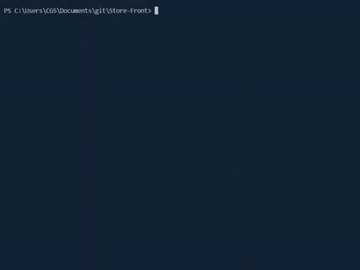
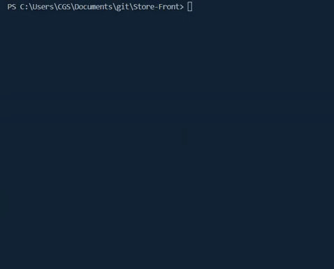

# Store Front

A command line store front created for node.js implementing a MySQL database.

## Install

- Clone this repo
- run `npm i`

## Using the application

### User Mode

User mode allows a user to purchase an item from the store.

run `node storefrontCustomer.js` or `npm run customer`

### Manager Mode

Manager mode allows a manager to view total stock, low stock, add products to inventory, or add a new product to the inventory.

run `node storefrontManager.js` or `npm run manager`

### Supervisor Mode 

Supervisor mode allows a supervisor to view department overheads or add new departments to the store.

run `node storefrontSupervisor.js` or `npm run supervisor`

## What I learned

This project was created to showcase using node with sql to develop a application that can use CRUD methodologies against a database. 

Outside of the scope of the project I also wanted to learn more about testing using the node library jest. Jest was a hard concept to tackle and I am not sure I have it fully figured out. I do believe that I have a working understanding of how to test things but do not quite grasp why or how.

I also built a small function helper that turns the query from mysql into a promise instead of using a callback. This allowed me to clean up my code a lot. I also found out that this functionality is built into the Node 8 utils library.